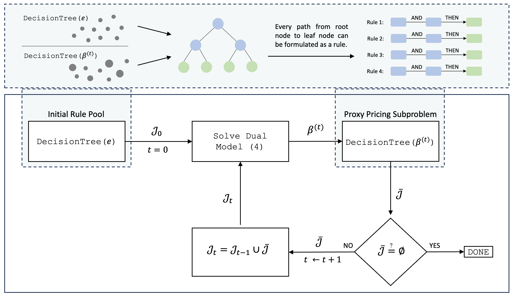

# RuleOpt
## Optimization-Based Rule Learning for Classification

RuleOpt is an optimization-based rule learning algorithm designed for classification problems. Focusing on scalability and interpretability, RuleOpt utilizes linear programming for rule generation and extraction. An earlier version of this work is available in [our manuscript](https://arxiv.org/abs/2104.10751).

 The Python library `ruleopt` is capable of extracting rules from ensemble models, and it also implements a novel rule generation scheme. The library ensures compatibility with existing machine learning pipelines, and it is especially efficient for tackling large-scale problems.

Here are a few highlights of `ruleopt`:

- **Efficient Rule Generation and Extraction**: Leverages linear programming for scalable rule generation (stand-alone machine learning method) and rule extraction from trained random forest and boosting models.
- **Interpretability**: Prioritizes model transparency by assigning costs to rules in order to achieve a desirable balance with accuracy.
- **Integration with Machine Learning Libraries**: Facilitates smooth integration with well-known Python libraries `scikit-learn`, `LightGBM`, and `XGBoost`, and existing machine learning pipelines.
- **Extensive Solver Support**: Supports a wide array of solvers, including _Gurobi_, _CPLEX_ and _OR-Tools_.

[](./img/flow_chart.png)

### Installation 
To install `ruleopt`, use the following pip command:

```bash
pip install ruleopt
```
### Usage

To use `ruleopt`, you need to initialize the `ruleopt` class with your specific parameters and fit it to your data. Here's a basic example:


```python
from sklearn.model_selection import train_test_split
from sklearn.datasets import load_iris

from ruleopt import RUGClassifier
from ruleopt.rule_cost import Gini
from ruleopt.solver import ORToolsSolver

# Set a random state for reproducibility
random_state = 42

# Load the Iris dataset
X, y = load_iris(return_X_y=True)

# Split the dataset into training and testing sets
X_train, X_test, y_train, y_test = train_test_split(
    X, y, test_size=0.2, random_state=random_state
)

# Define tree parameters
tree_parameters = {"max_depth": 3, "class_weight": "balanced"}

solver = ORToolsSolver()
rule_cost = Gini()

# Initialize the RUGClassifier with specific parameters
rug = RUGClassifier(
    solver=solver,
    random_state=random_state,
    max_rmp_calls=20,
    rule_cost=rule_cost,
    **tree_parameters,
)

# Fit the RUGClassifier to the training data
rug.fit(X_train, y_train)

# Predict the labels of the testing set
y_pred = rug.predict(X_test)
```
### Documentation
For more detailed information about the API and advanced usage, please refer to the full  [documentation](https://ruleopt.readthedocs.io/en/latest/).

### Contributing
Contributions are welcome! If you'd like to improve `ruleopt` or suggest new features, feel free to fork the repository and submit a pull request.

### License
`ruleopt` is released under the BSD 3-Clause License. See the LICENSE file for more details.
